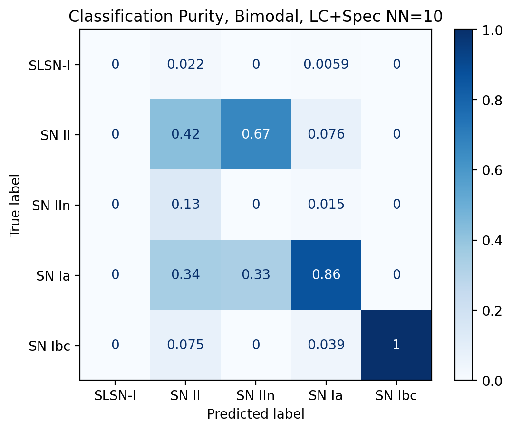
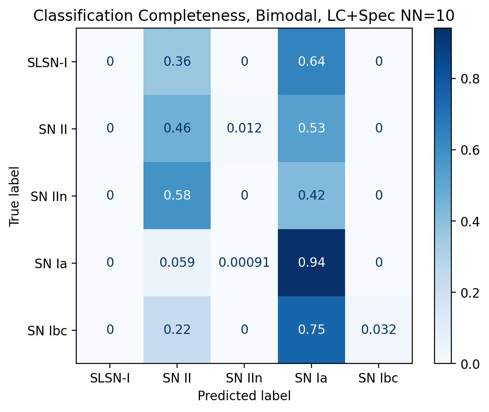
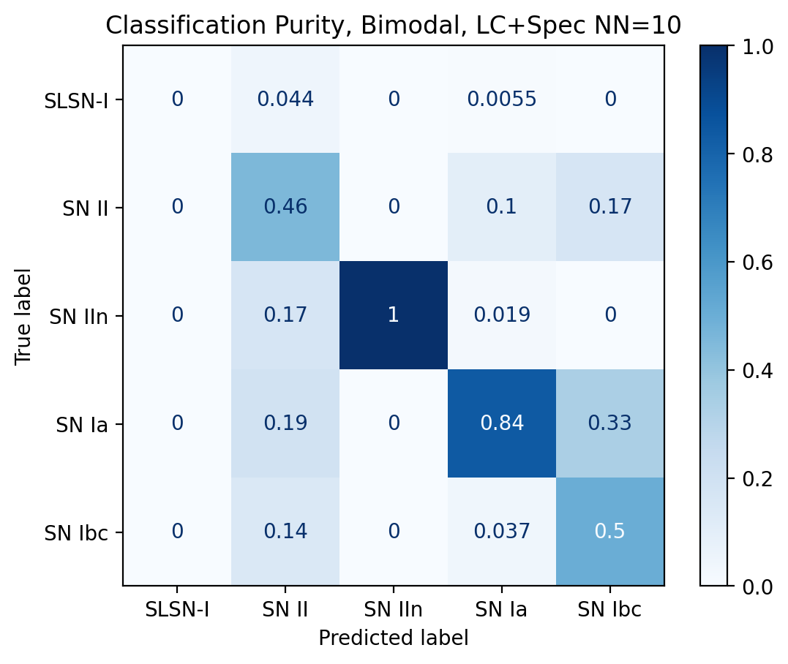
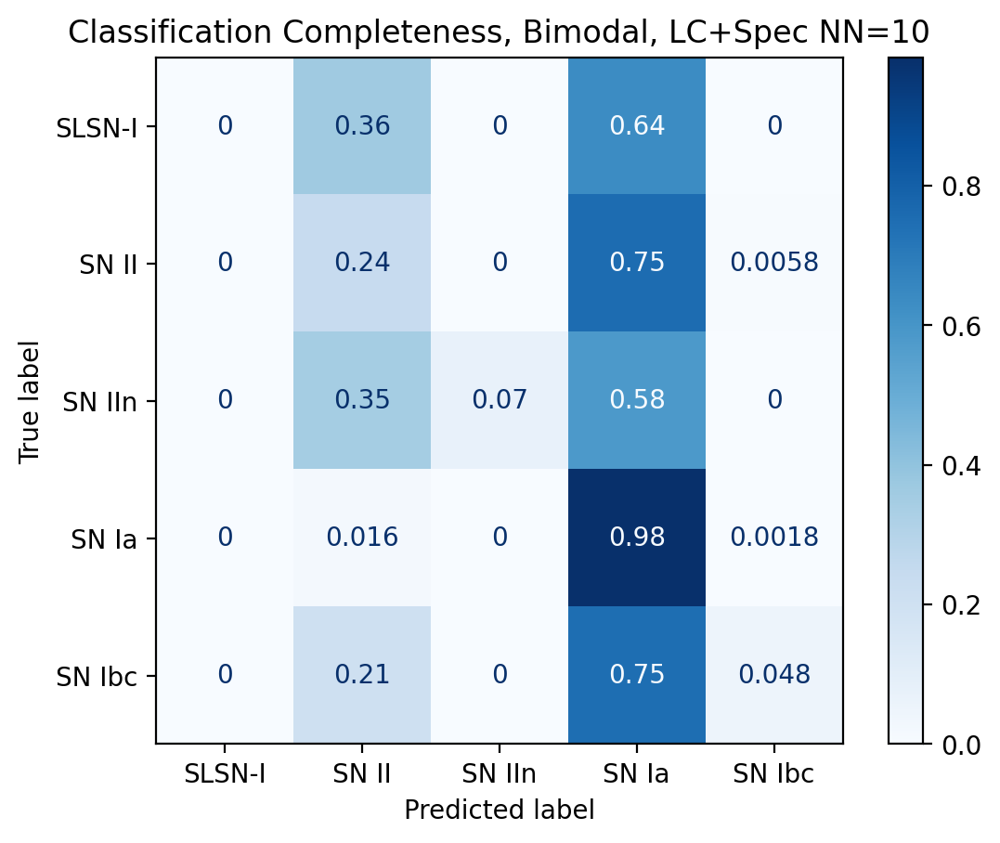

# AstronomicalSupernova_Transient-SciML

Machine learning experiments for learning representations of astronomical transients from heterogeneous observations.

<p align="center">
  
</p>

## Results at a glance

The repository includes five-class purity and completeness figures for representative modality combinations. These plots show how well the learned representation separates transient classes as the retrieval threshold changes. The labels in each filename identify the experiment family, including bimodal or trimodal inputs and the spectral/light-curve encoder settings.

| Purity | Completeness |
|:------:|:------------:|
|  |  |
| Bimodal spectral + light-curve representation | Bimodal spectral + light-curve representation |
|  |  |
| Trimodal representation | Trimodal representation |

These are repository artifacts for illustrating the evaluation outputs, not a claim that one configuration is universally best. The training scripts also generate `loss_history.png` and, for contrastive runs with multiple modalities, `ROC_curves.png` inside each run directory under `analysis/` or the configured model-output directory.

## Research question

Can a model learn a more useful representation of a transient by jointly aligning the information in its light curve, spectrum, host-galaxy image, and available metadata than by using any single observation type alone?

This repository addresses that question with a controlled set of experiments:

- **Multimodal contrastive learning:** modality-specific encoders map paired observations of the same transient into a shared embedding space. The training objective rewards matching observations and separates unrelated observations.
- **Masked light-curve pretraining:** a transformer reconstructs masked sections of a light curve, providing an optional initialization for downstream models.
- **Downstream prediction:** the learned representations are used for redshift regression and three- or five-class transient classification.
- **Ablations and comparisons:** configurations can use `lightcurve`, `spectral`, `host_galaxy`, and `meta` in different combinations, with optional simulated pretraining, noisy augmentation, frozen backbones, and stratified cross-validation.

### What is the answer?

The project is designed to test whether multimodality improves representation quality and downstream prediction. Its scientific answer is empirical: compare the validation and held-out metrics of the same architecture and split across modality combinations and training strategies. The code does not assume that adding a modality always helps; missing, noisy, or weakly informative observations can make a unimodal model competitive. Run `evaluate_models.py` on the trained checkpoints to produce the comparison rather than treating the research question as settled by the model design alone.

## Data

The repository does not include the observational dataset or the large simulated HDF5 file. The real-data loader expects a directory with this structure:

```text
ZTFBTS/
├── ZTFBTS_TransientTable.csv
├── hostImgs/
│   └── <ZTFID>.host.png
└── light-curves/
    └── <ZTFID>.csv

ZTFBTS_spectra/
└── <ZTFID>.csv
```

Each transient is joined by its `ZTFID`. Light-curve CSV files must contain `time`, `mag`, `magerr`, and `band` columns. Spectral CSV files contain either `freq,spec` or `freq,spec,specerr`. The transient table supplies redshift, class, and extinction information.

The included data note describes the ZTF Bright Transient Survey selection. The current loader applies Milky Way extinction corrections to light curves, pads or truncates sequences, masks padded values, normalizes time per band, scales host images to `[0, 1]`, and can rescale spectra to avoid floating-point issues.

For simulated pretraining, place the HDF5 file configured by `pretrain_config/maven_pretrain_config.yaml` at:

```text
data/sim_data/ZTF_Pretrain_5Class.hdf5
```

The HDF5 file is expected to contain the simulated photometry and spectral groups used by `SimulationDataset`.

## Installation

```bash
git clone https://github.com/hassaan4717/AstronomicalSupernova_Transient-SciML.git
cd AstronomicalSupernova_Transient-SciML

python -m venv .venv
# Windows PowerShell
.\.venv\Scripts\Activate.ps1
# Linux or macOS
# source .venv/bin/activate

python -m pip install --upgrade pip
python -m pip install -r requirements.txt
```

Python 3.8 or newer is required. A CUDA-enabled PyTorch installation is recommended for practical training, but the scripts fall back to CPU execution when CUDA is unavailable.

## Weights & Biases

Training is managed through Weights & Biases sweeps. Create a W&B account, then authenticate once in the environment where training will run:

```bash
wandb login
```

The configuration files contain the W&B `entity` and `project`. Change them to match the account and project that should receive the runs. The scripts save sweep configurations, checkpoints, split filenames, and diagnostic plots below `analysis/`.

## Training workflows

All commands below are run from the repository root.

### 1. Train a model on real observations

The default real-data workflow is configured in `configs/maven-lite.yaml`:

```bash
python script_wandb.py configs/maven-lite.yaml
```

`script_wandb.py` loads the configured modality combination, applies noise augmentation during training, creates train/validation or stratified k-fold splits, trains the multimodal model, and writes checkpoints and metrics. Set these fields under `extra_args` to change the task:

```yaml
extra_args:
  combinations: [lightcurve, spectral]
  regression: false
  classification: false
```

Use `regression: true` for redshift prediction. Use `classification: true` and set `n_classes` to `3` or `5` for transient-type classification. Keep both false for contrastive representation learning.

Supported modality names are `lightcurve`, `spectral`, `host_galaxy`, and `meta`. The `meta` encoder uses class and redshift values as auxiliary inputs and should be treated carefully in any scientific comparison because those values are also prediction targets or closely related to them.

### 2. Pretrain on simulated transients

After placing the simulated HDF5 file under `data/sim_data/`, run:

```bash
python pretraining_clip_wandb.py pretrain_config/maven_pretrain_config.yaml
```

This trains a contrastive model on simulated light curves and spectra. The configuration controls the sequence lengths, noise setting, encoder sizes, optimization parameters, and W&B sweep.

### 3. Fine-tune a pretrained model

Set `extra_args.pretrain_path` in `configs/maven_finetune.yaml` to a checkpoint produced by pretraining, then run:

```bash
python finetune_clip.py configs/maven_finetune.yaml
```

Use `extra_args.freeze_backbone: true` to keep the pretrained encoders fixed while training the downstream head. Set it to `false` to fine-tune the full model.

### 4. Resume a sweep

When a sweep has already been scheduled, pass its saved sweep directory or identifier as accepted by the script:

```bash
python script_wandb.py <sweep-directory-or-id>
```

The scripts store the generated sweep configuration under `analysis/<sweep-id>/`.

## Evaluation

`evaluate_models.py` loads the checkpoint directories listed near the top of the file, reconstructs each model, reloads the train and validation transient splits, and computes comparison metrics. Before running it:

1. Make sure the real-data directories are available in one of the paths searched by the script, or update its `data_dirs` lists.
2. Add or remove checkpoint directories in `directories` and matching display names in `names`.
3. Run:

```bash
python evaluate_models.py
```

The evaluation code supports redshift regression, three- and five-class classification, linear and k-nearest-neighbor probes on learned embeddings, confusion matrices, prediction plots, and aggregate comparison plots. It also checks that the filenames loaded for evaluation belong to the splits saved during training.

### Generated diagnostics

Training runs produce visual diagnostics alongside their checkpoints:

- `loss_history.png` compares training and validation loss across epochs.
- `ROC_curves.png` compares cross-modal retrieval by measuring whether an observation retrieves its paired observation in embedding space.
- Evaluation runs can additionally create normalized confusion matrices, prediction-versus-truth plots, and radar plots through the helpers in `src/utils.py`.

For a new experiment, inspect these files together with the saved `config.yaml`, `train_filenames.txt`, and `val_filenames.txt`. A falling training loss alone is not evidence that the representation generalizes; validation curves and object-level held-out metrics are the relevant checks.

## Repository layout

```text
AstronomicalSupernova_Transient-SciML/
├── configs/                   W&B configurations for real-data experiments
├── data/                     Data notes and local data mount point
├── evaluation_metrics/       Evaluation-related outputs and resources
├── models/                   Saved or tracked model experiment directories
├── pretrain_config/          Configuration for simulated pretraining
├── src/
│   ├── dataloader.py         Data loading, alignment, padding, masking, and augmentation
│   ├── loss.py               Contrastive losses
│   ├── models_multimodal.py  Multimodal encoders and prediction heads
│   ├── models_pretraining.py Masked light-curve pretraining
│   ├── transformer_utils.py  Time-aware transformer components
│   ├── utils.py              Metrics, probes, plots, and reproducibility helpers
│   └── wandb_utils.py        Sweep creation and continuation
├── evaluate_models.py        Checkpoint evaluation and comparison
├── finetune_clip.py          Pretrained-model fine-tuning
├── pretraining_clip_wandb.py Simulated contrastive pretraining
├── script_wandb.py           Real-data training and downstream tasks
└── tests/                    Data-loader tests
```

## Testing

The data-loader test requires the real dataset directories because it verifies modality alignment and time normalization:

```bash
pytest tests/test_dataloader.py
```

Without the dataset, the test cannot load `ZTFBTS/` and `ZTFBTS_spectra/`. The test suite does not download data automatically.

## Reproducibility and scientific comparisons

- Set the same `seed`, modality combination, split strategy, sequence limits, and preprocessing factors when comparing models.
- Use the saved `train_filenames.txt` and `val_filenames.txt` to preserve object-level splits.
- Keep validation data unaugmented; training loaders add noise based on measurement errors and apply random host-image rotations where applicable.
- Report results across the configured folds rather than relying on a single random split.
- Treat simulated pretraining, real-only training, frozen-backbone fine-tuning, and unimodal baselines as separate experimental conditions.

## License

This project is released under the MIT License. See [LICENSE](LICENSE).

## Repository

Source code: https://github.com/hassaan4717/AstronomicalSupernova_Transient-SciML
